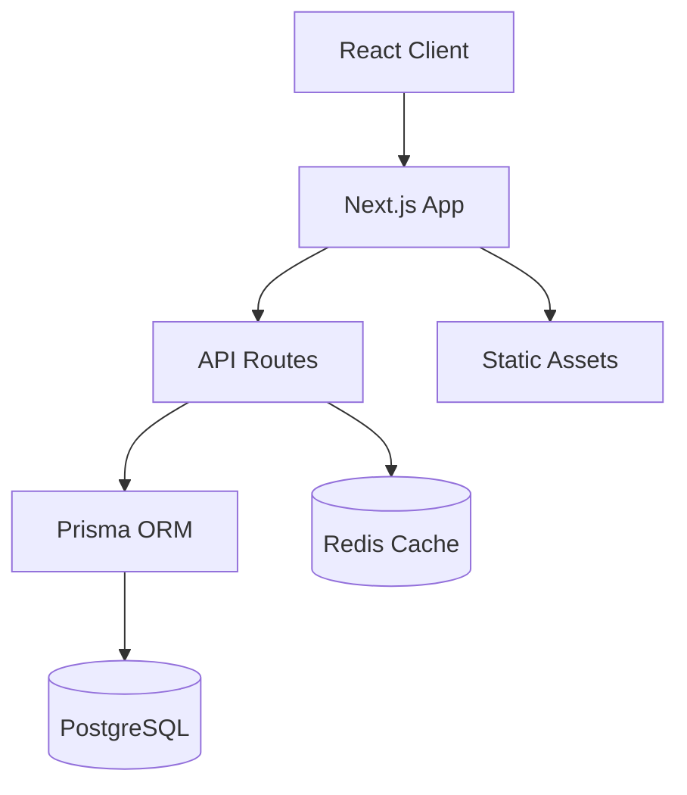
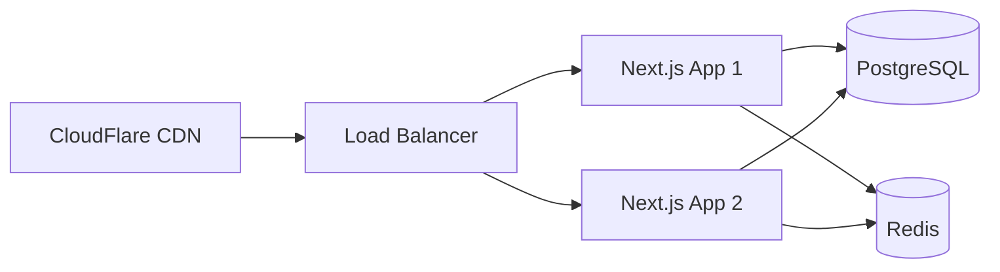

# 🏗 LinkPick 아키텍처 문서

## 📋 목차

- [시스템 개요](#시스템-개요)
- [기술 스택](#기술-스택)
- [프로젝트 구조](#프로젝트-구조)
- [데이터 모델](#데이터-모델)
- [API 설계](#api-설계)
- [인증 및 보안](#인증-및-보안)
- [캐싱 전략](#캐싱-전략)
- [에러 처리](#에러-처리)
- [배포 아키텍처](#배포-아키텍처)

## 시스템 개요

LinkPick은 Next.js 14의 App Router를 기반으로 하는 풀스택 웹 애플리케이션입니다.



## 기술 스택

### Frontend
- **Framework**: Next.js 14.2.0 (App Router)
- **Language**: TypeScript 5.3.3
- **Styling**: Tailwind CSS + Radix UI
- **State Management**: Zustand
- **Data Fetching**: React Query + Axios

### Backend
- **Runtime**: Node.js
- **API**: Next.js API Routes
- **Database**: PostgreSQL 15
- **ORM**: Prisma 5.22.0
- **Cache**: Redis 7
- **Authentication**: JWT (자체 구현)

## 프로젝트 구조

```
src/
├── app/                    # Next.js App Router
│   ├── (auth)/            # 인증 관련 페이지 그룹
│   ├── admin/             # 관리자 페이지
│   ├── api/               # API 엔드포인트
│   ├── business/          # 비즈니스 사용자 페이지
│   └── campaigns/         # 캠페인 페이지
├── components/            # React 컴포넌트
│   ├── ui/               # 기본 UI 컴포넌트
│   ├── layouts/          # 레이아웃 컴포넌트
│   └── admin/            # 관리자 전용 컴포넌트
├── lib/                   # 유틸리티 및 서비스
│   ├── auth/             # 인증 로직
│   ├── cache/            # 캐싱 로직
│   ├── db/               # 데이터베이스 연결
│   ├── modules/          # 모듈화된 비즈니스 로직
│   └── services/         # 서비스 계층
└── types/                # TypeScript 타입 정의
```

### 주요 디렉토리 설명

#### `/app`
Next.js 14 App Router 구조를 따릅니다:
- 파일 기반 라우팅
- 서버/클라이언트 컴포넌트 분리
- 레이아웃 시스템 활용

#### `/lib/services`
비즈니스 로직을 담당하는 서비스 계층:
- `auth.service.ts`: 인증 관련 로직
- `campaign.service.ts`: 캠페인 관리
- `payment.service.ts`: 결제 처리
- `user.service.ts`: 사용자 관리

#### `/lib/modules`
모듈화된 기능 단위:
- 각 모듈은 독립적인 기능 제공
- Router, Service, Adapter 패턴 사용

## 데이터 모델

### 주요 엔티티

```typescript
// User - 사용자
model User {
  id                   String                @id @default(cuid())
  email                String                @unique
  password             String
  name                 String
  type                 String                // INFLUENCER, BUSINESS, ADMIN
  status               String                @default("ACTIVE")
  profile              Profile?
  businessProfile      BusinessProfile?
  campaigns            Campaign[]
  applications         CampaignApplication[]
}

// Campaign - 캠페인
model Campaign {
  id              String                @id @default(cuid())
  businessId      String
  title           String
  description     String
  platform        String
  budget          Float
  targetFollowers Int
  startDate       DateTime
  endDate         DateTime
  status          String                @default("DRAFT")
  applications    CampaignApplication[]
}

// CampaignApplication - 캠페인 지원
model CampaignApplication {
  id              String           @id @default(cuid())
  campaignId      String
  influencerId    String
  message         String
  proposedPrice   Float?
  status          String           @default("PENDING")
  contents        Content[]
}
```

### 관계 설계
- 1:1 관계: User ↔ Profile/BusinessProfile
- 1:N 관계: User → Campaign, Campaign → CampaignApplication
- N:M 관계: User ↔ User (Follow 관계)

## API 설계

### RESTful 엔드포인트

```
GET     /api/campaigns          # 캠페인 목록
GET     /api/campaigns/:id      # 캠페인 상세
POST    /api/campaigns          # 캠페인 생성
PUT     /api/campaigns/:id      # 캠페인 수정
DELETE  /api/campaigns/:id      # 캠페인 삭제
```

### API 응답 형식

```typescript
// 성공 응답
interface SuccessResponse<T> {
  success: true
  data: T
  meta?: {
    page?: number
    totalPages?: number
    total?: number
  }
}

// 에러 응답
interface ErrorResponse {
  error: string
  code?: string
  details?: any
}
```

## 인증 및 보안

### JWT 기반 인증

```typescript
// JWT 페이로드
interface JWTPayload {
  id: string
  email: string
  type: UserType
  iat: number
  exp: number
}
```

### 인증 플로우

1. **로그인**: 이메일/비밀번호 → JWT 토큰 발급
2. **인증 확인**: Authorization 헤더의 Bearer 토큰 검증
3. **권한 확인**: 사용자 타입에 따른 접근 제어

### 보안 조치

- 비밀번호: bcrypt 해싱
- JWT: RS256 알고리즘 (프로덕션)
- HTTPS 전용 쿠키
- CORS 설정
- Rate limiting (계획)

## 캐싱 전략

### Redis 캐싱

```typescript
// 캐시 키 패턴
const cacheKeys = {
  user: (id: string) => `user:${id}`,
  campaign: (id: string) => `campaign:${id}`,
  campaignList: (page: number) => `campaigns:list:${page}`,
  homeStats: () => 'home:statistics'
}
```

### 캐시 무효화

- Write-through: 데이터 변경 시 즉시 캐시 업데이트
- TTL 기반: 시간 기반 자동 만료
- 태그 기반: 관련 캐시 일괄 무효화

## 에러 처리

### 에러 타입

```typescript
class AppError extends Error {
  constructor(
    public message: string,
    public statusCode: number,
    public code?: string
  ) {
    super(message)
  }
}
```

### 글로벌 에러 핸들러

- API 라우트: try-catch + 에러 응답
- 페이지: Error Boundary 컴포넌트
- 로깅: 개발/프로덕션 환경 구분

## 배포 아키텍처

### 개발 환경

```yaml
services:
  postgres:
    image: postgres:15
    ports: ["5432:5432"]
  
  redis:
    image: redis:7
    ports: ["6379:6379"]
  
  app:
    build: .
    ports: ["3000:3000"]
    depends_on: [postgres, redis]
```

### 프로덕션 환경



### 확장성 고려사항

1. **수평 확장**: 무상태 설계로 인스턴스 추가 가능
2. **데이터베이스**: Read Replica, Connection Pooling
3. **캐싱**: Redis Cluster 구성 가능
4. **CDN**: 정적 자산 및 API 캐싱

## 성능 최적화

### Frontend
- Next.js Image 최적화
- 코드 스플리팅
- 프리페칭
- Web Vitals 모니터링

### Backend
- 데이터베이스 인덱싱
- N+1 쿼리 방지
- API 응답 캐싱
- 비동기 작업 처리

## 모니터링 및 로깅

### 계획된 통합
- **APM**: New Relic / DataDog
- **에러 추적**: Sentry
- **로깅**: Winston + CloudWatch
- **분석**: Google Analytics + Mixpanel