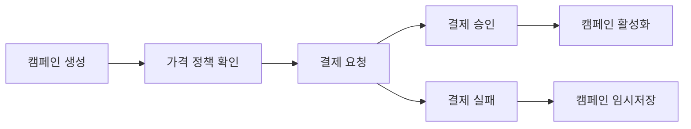

# 💳 LinkPick 결제 시스템 설계

## 개요

LinkPick의 결제 시스템은 **업체(Business)가 캠페인을 등록할 때 지불하는 등록 수수료**를 처리합니다.

## 결제 구조

### 1. 캠페인 등록 프로세스



### 2. 가격 정책

#### 기본 등록비
- **베이직**: 100,000원 (인플루언서 10명까지)
- **스탠다드**: 300,000원 (인플루언서 30명까지)  
- **프리미엄**: 500,000원 (인플루언서 무제한)

#### 추가 옵션
- **긴급 노출**: +50,000원 (상단 노출 7일)
- **타겟팅 강화**: +30,000원 (AI 정밀 매칭)
- **성과 분석 리포트**: +20,000원

### 3. 결제 타이밍

1. **선불 결제**: 캠페인 등록 시 즉시 결제
2. **캠페인 상태**:
   - `DRAFT`: 결제 전 (임시저장)
   - `PENDING_PAYMENT`: 결제 대기
   - `ACTIVE`: 결제 완료 (캠페인 공개)

## 데이터베이스 스키마

### 가격 정책 테이블

```prisma
model PricingPlan {
  id          String   @id @default(cuid())
  name        String   @unique
  displayName String
  basePrice   Float
  maxInfluencers Int?  // null = 무제한
  features    Json     // 포함된 기능 목록
  isActive    Boolean  @default(true)
  order       Int      @default(0)
  createdAt   DateTime @default(now())
  updatedAt   DateTime @updatedAt
  
  @@map("pricing_plans")
}

model PricingOption {
  id          String   @id @default(cuid())
  code        String   @unique
  name        String
  description String?
  price       Float
  type        String   // ADDON, UPGRADE
  isActive    Boolean  @default(true)
  createdAt   DateTime @default(now())
  updatedAt   DateTime @updatedAt
  
  @@map("pricing_options")
}
```

### 캠페인-결제 연동

```prisma
model Campaign {
  // 기존 필드...
  pricingPlanId String?
  pricingPlan   PricingPlan? @relation(fields: [pricingPlanId], references: [id])
  selectedOptions Json?      // 선택한 추가 옵션
  totalPrice    Float?       // 최종 결제 금액
}

model Payment {
  // 기존 필드...
  itemType      String       // CAMPAIGN_REGISTRATION
  itemId        String       // campaignId
  breakdown     Json         // 가격 상세 내역
}
```

## 결제 플로우

### 1. 캠페인 생성 시

```typescript
// 1단계: 캠페인 임시 생성 (DRAFT)
const campaign = await createCampaign({
  ...campaignData,
  status: 'DRAFT',
  pricingPlanId: selectedPlan.id,
  selectedOptions: ['urgent_exposure', 'ai_targeting'],
})

// 2단계: 가격 계산
const pricing = await calculateCampaignPrice(campaign.id)
// {
//   basePrice: 300000,
//   options: [
//     { code: 'urgent_exposure', price: 50000 },
//     { code: 'ai_targeting', price: 30000 }
//   ],
//   total: 380000
// }

// 3단계: 결제 요청
const payment = await createPayment({
  campaignId: campaign.id,
  amount: pricing.total,
  itemType: 'CAMPAIGN_REGISTRATION',
  breakdown: pricing
})
```

### 2. 결제 완료 시

```typescript
// 결제 승인 후
await handlePaymentSuccess(payment.id)
// - 캠페인 상태를 ACTIVE로 변경
// - 영수증 발행
// - 알림 발송
```

## 가격 정책 관리

### 관리자 기능
- 가격 플랜 생성/수정
- 추가 옵션 관리
- 프로모션 코드 적용
- 할인 정책 설정

### API 엔드포인트

```
GET /api/pricing/plans          # 가격 플랜 목록
GET /api/pricing/options        # 추가 옵션 목록
POST /api/pricing/calculate     # 가격 계산
POST /api/campaigns/:id/payment # 캠페인 결제 요청
```

## 환불 정책

- 캠페인 시작 전: 100% 환불
- 캠페인 진행 중: 환불 불가
- 시스템 오류: 100% 환불 + 보상