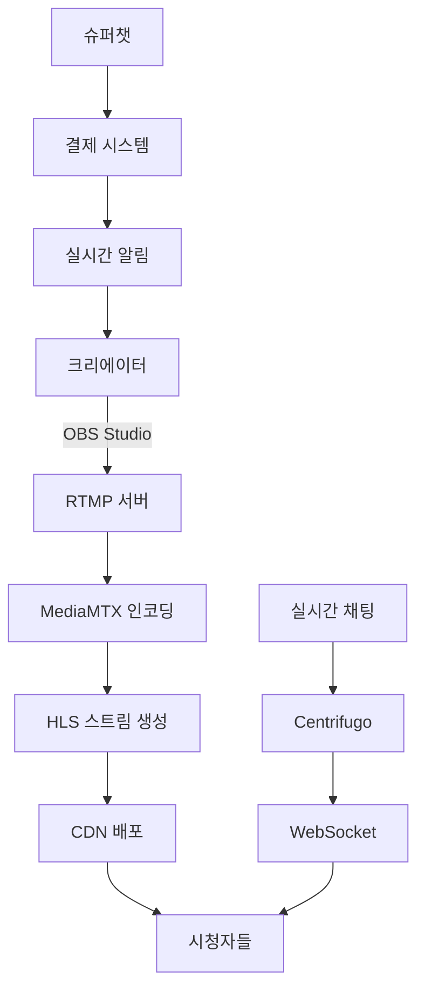
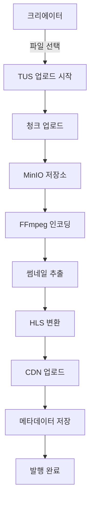
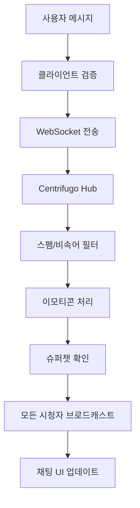
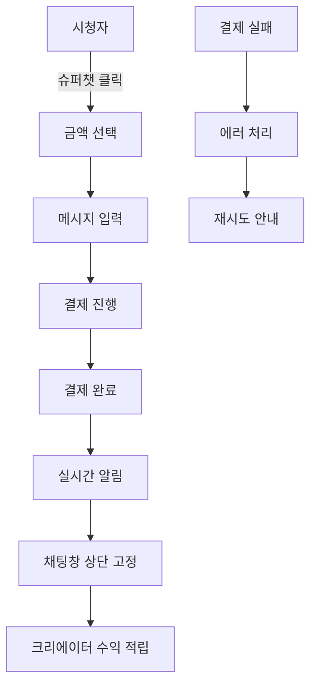
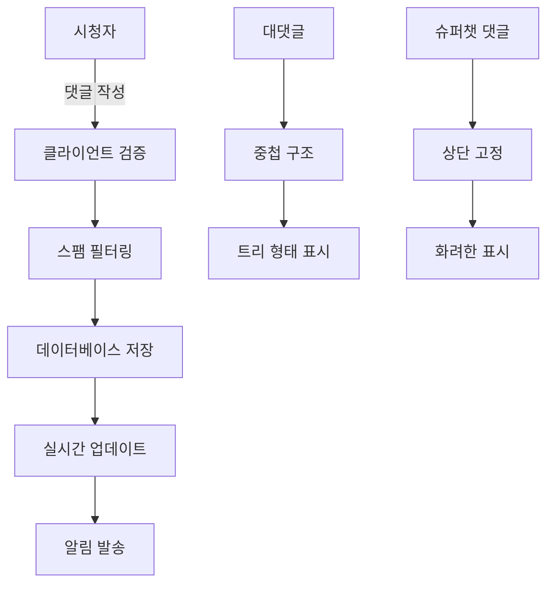

# 🎬 VideoPick 플랫폼 PRD (Product Requirements Document)

## 📋 프로젝트 개요

### 🎯 비전
**"크리에이터와 시청자가 소통하며 함께 성장하는 차세대 비디오 스트리밍 플랫폼"**

### 🎪 미션  
- **라이브 스트리밍**: 실시간 소통과 수익화가 가능한 방송 환경
- **VOD 서비스**: 대용량 비디오 업로드와 고품질 재생 경험
- **인터랙티브 채팅**: 이모티콘, 슈퍼챗, 자막 효과가 있는 실시간 채팅
- **커뮤니티**: 댓글, 하트, 구독 기반의 활발한 소통

---

## 🏗️ 핵심 기능 아키텍처

### 🎥 1. 라이브 스트리밍 서비스

#### 1.1 스트리밍 플로우 


#### 1.2 기술적 요구사항

**스트리밍 서버 사양**:
- **RTMP 서버**: MediaMTX (rtmp://stream.one-q.xyz:1935/live)
- **HLS 출력**: 멀티 비트레이트 (1080p, 720p, 480p, 360p)
- **지연시간**: < 5초 (Low Latency HLS)
- **동시 시청자**: 최대 50,000명 지원

**스트림 설정**:
```yaml
stream_config:
  input:
    protocol: RTMP
    port: 1935
    path: /live/{streamKey}
  
  output:
    format: HLS
    segments: 6초 간격
    playlist: m3u8
    resolutions: [1080p, 720p, 480p, 360p]
    
  chat:
    protocol: WebSocket
    server: Centrifugo
    max_message_length: 500
```

#### 1.3 UI/UX 요구사항

**크리에이터 스튜디오 - 라이브 관리**:
```
┌─────────────────────────────────────────┐
│ 🔴 LIVE  │  시청자 1,247 │ 💰 ₩45,600  │
├─────────────────────────────────────────┤
│ 📊 실시간 통계                            │
│ • 최고 시청자: 2,150명                    │
│ • 평균 시청 시간: 12분 30초               │
│ • 슈퍼챗 수: 23개                        │
│                                         │
│ 🎛️ 방송 제어                            │
│ [ 스트림키 복사 ] [ 방송종료 ]           │
│                                         │
│ 💬 채팅 모니터링 (실시간)                │
│ └─ 비속어/스팸 자동 필터링              │
└─────────────────────────────────────────┘
```

**시청자 라이브 페이지**:
```
┌─────────────────────────────────────────┐
│          🎥 비디오 플레이어              │
│      (HLS.js 자동 품질 조정)            │
├─────────────────────────────────────────┤
│ 👤 크리에이터명     🔴 1,247 시청 중    │
│ 📝 방송 제목이 여기에 표시됩니다         │
├─────────────────────────────────────────┤
│ 💬 실시간 채팅                          │
│ ┌─ 💎 슈퍼챗 고정 영역 ─┐              │
│ │ "응원합니다!" - 홍길동 (₩5,000)     │
│ └─────────────────────────┘              │
│ 😀 일반채팅메시지들...                  │
│ 🎉 이모티콘 효과들...                   │
│ ┌─ 채팅 입력창 ─┐                     │
│ │ [😀] [💰] 메시지 입력... [전송]     │
│ └─────────────────────────────┘          │
└─────────────────────────────────────────┘
```

#### 1.4 데이터베이스 스키마 최적화

**라이브 스트리밍 핵심 테이블**:
```sql
-- 기존 live_streams 테이블 활용 및 확장
ALTER TABLE live_streams ADD COLUMN IF NOT EXISTS:
  category VARCHAR(50),
  language VARCHAR(10) DEFAULT 'ko',
  tags TEXT[],
  moderators JSONB DEFAULT '[]',
  chat_settings JSONB DEFAULT '{}';

-- 실시간 메트릭 테이블 신규 추가
CREATE TABLE stream_metrics (
  id UUID PRIMARY KEY,
  stream_id UUID REFERENCES live_streams(id),
  timestamp TIMESTAMP DEFAULT NOW(),
  viewer_count INTEGER,
  chat_message_count INTEGER,
  super_chat_amount DECIMAL(10,2),
  quality_issues INTEGER DEFAULT 0
);
```

---

### 📹 2. 대용량 VOD 업로드 서비스

#### 2.1 업로드 플로우


#### 2.2 기술적 요구사항

**업로드 시스템**:
- **프로토콜**: TUS (Resumable Upload)
- **최대 파일 크기**: 50GB
- **지원 형식**: MP4, MOV, AVI, MKV, WebM
- **청크 크기**: 10MB
- **동시 업로드**: 크리에이터당 5개

**인코딩 파이프라인**:
```yaml
encoding_config:
  input_formats: [mp4, mov, avi, mkv, webm]
  max_file_size: 50GB
  
  output_qualities:
    - resolution: 1080p
      bitrate: 8000kbps
      fps: 60
    - resolution: 720p
      bitrate: 5000kbps
      fps: 30
    - resolution: 480p
      bitrate: 2500kbps
      fps: 30
    - resolution: 360p
      bitrate: 1000kbps
      fps: 30
  
  thumbnails:
    count: 5
    times: [10%, 25%, 50%, 75%, 90%]
    resolution: 1280x720
```

#### 2.3 UI/UX 요구사항

**업로드 페이지**:
```
┌─────────────────────────────────────────┐
│ 📤 비디오 업로드                         │
├─────────────────────────────────────────┤
│ 📁 파일 선택 (드래그 & 드롭)             │
│ ┌─ 업로드 진행률 ─┐                    │
│ │ ████████░░ 80% (2.1GB / 2.6GB)     │
│ │ 예상 완료: 3분 12초                  │
│ │ [ ⏸️ 일시정지 ] [ ❌ 취소 ]          │
│ └─────────────────────────────────────┘  │
│                                         │
│ ✏️ 비디오 정보                          │
│ 📝 제목: [___________________]          │
│ 📄 설명: [___________________]          │
│ 🏷️ 태그: [___________________]          │
│ 📂 카테고리: [게임 ▼]                   │
│                                         │
│ 🖼️ 썸네일 선택                          │
│ [img1] [img2] [img3] [업로드]           │
│                                         │
│ 🔒 공개 설정                            │
│ ○ 공개  ○ 비공개  ○ 예약발행           │
│                                         │
│ [ 업로드 계속하기 ]                     │
└─────────────────────────────────────────┘
```

**인코딩 상태 페이지**:
```
┌─────────────────────────────────────────┐
│ ⚙️ 비디오 처리 중...                    │
├─────────────────────────────────────────┤
│ 📹 업로드 완료 ✅                       │
│ 🎬 인코딩 진행 중... ████░░░░ 60%       │
│ 🖼️ 썸네일 생성 ⏳                      │
│ 📊 메타데이터 처리 ⏳                   │
│                                         │
│ 예상 완료 시간: 약 15분                 │
│                                         │
│ [ 스튜디오로 돌아가기 ]                 │
└─────────────────────────────────────────┘
```

---

### 💬 3. 실시간 채팅 시스템

#### 3.1 채팅 플로우


#### 3.2 기술적 요구사항

**채팅 서버 설정**:
```yaml
centrifugo_config:
  websocket:
    compression: true
    max_channel_length: 255
    max_message_size: 65536
    
  channels:
    live_chat: "live:{streamId}"
    super_chat: "super:{streamId}"
    moderator: "mod:{streamId}"
  
  features:
    presence: true
    history: 100  # 최근 100개 메시지 보관
    rate_limit: "10/s"  # 초당 10개 메시지
```

**메시지 타입 정의**:
```typescript
interface ChatMessage {
  id: string;
  type: 'message' | 'super_chat' | 'emoji_effect' | 'system';
  userId: string;
  username: string;
  content: string;
  timestamp: number;
  
  // 슈퍼챗용
  amount?: number;
  currency?: string;
  color?: string;
  duration?: number; // 고정 표시 시간(초)
  
  // 이모티콘 효과용
  emoji?: string;
  effect?: 'rain' | 'explosion' | 'heart' | 'fire';
  
  // 모더레이션용
  isPinned?: boolean;
  isDeleted?: boolean;
  moderatorId?: string;
}
```

#### 3.3 UI/UX 요구사항

**채팅 UI 컴포넌트**:
```
┌─────────────────────────────────────────┐
│ 💬 채팅 (1,247명 참여 중)               │
├─────────────────────────────────────────┤
│ ┌─ 💎 슈퍼챗 고정 영역 ─┐              │
│ │ 🎉 "응원합니다!" - 홍길동           │
│ │    ₩10,000 • 2분 남음               │
│ │ ❤️ "최고예요!" - 김영희              │
│ │    ₩5,000 • 30초 남음               │
│ └─────────────────────────────────────┘  │
│                                         │
│ 📜 채팅 메시지들                        │
│ 😀 김철수: 안녕하세요!                  │
│ 🎮 게이머123: 와 대박!                  │
│ ❤️💥 [하트 효과 애니메이션]             │
│ 🎯 모더레이터: 공지사항입니다 📌         │
│                                         │
│ ┌─ 채팅 입력 ─┐                       │
│ │ [😀] [💰] 메시지... [🎁] [전송]     │
│ └─────────────────────────────────────┘  │
│                                         │
│ 🛠️ 채팅 옵션                           │
│ [ 이모지만 ] [ 슈퍼챗만 ] [ 전체 ]    │
└─────────────────────────────────────────┘
```

**이모티콘 효과 시스템**:
```typescript
const EmojiEffects = {
  // 기본 이모티콘
  basic: ['😀', '😂', '❤️', '👏', '🔥', '💯', '🎉', '👍'],
  
  // 특수 효과 (유료)
  premium: {
    '💎': { price: 100, effect: 'sparkle', duration: 3 },
    '🎆': { price: 200, effect: 'fireworks', duration: 5 },
    '❤️‍🔥': { price: 300, effect: 'heart_explosion', duration: 5 },
    '🌟': { price: 500, effect: 'star_rain', duration: 8 }
  },
  
  // 시즌 이모티콘 (이벤트)
  seasonal: ['🎄', '🎃', '🌸', '☀️', '❄️']
};
```

---

### 💰 4. 슈퍼챗 (Super Chat) 시스템

#### 4.1 슈퍼챗 플로우


#### 4.2 기술적 요구사항

**슈퍼챗 가격 정책**:
```typescript
const SuperChatTiers = {
  bronze: { amount: 1000, color: '#CD7F32', duration: 30 },
  silver: { amount: 3000, color: '#C0C0C0', duration: 60 },
  gold: { amount: 5000, color: '#FFD700', duration: 120 },
  platinum: { amount: 10000, color: '#E5E4E2', duration: 300 },
  diamond: { amount: 50000, color: '#B9F2FF', duration: 600 }
};

const RevenueShare = {
  creator: 0.70,    // 크리에이터 70%
  platform: 0.25,  // 플랫폼 25%
  payment_fee: 0.05 // 결제 수수료 5%
};
```

**결제 통합**:
```yaml
payment_methods:
  - toss_payments
  - kakao_pay
  - naver_pay
  - credit_card
  - bank_transfer
  
webhooks:
  success: "/api/payments/super-chat/success"
  fail: "/api/payments/super-chat/fail"
  cancel: "/api/payments/super-chat/cancel"
```

#### 4.3 UI/UX 요구사항

**슈퍼챗 모달**:
```
┌─────────────────────────────────────────┐
│ 💎 슈퍼챗으로 응원하기                   │
├─────────────────────────────────────────┤
│ 💰 금액 선택                            │
│ [₩1,000] [₩3,000] [₩5,000]             │
│ [₩10,000] [₩50,000] [직접입력]          │
│                                         │
│ ✨ 선택 효과: 골드 (2분간 상단 고정)     │
│                                         │
│ 💬 메시지 (선택사항)                     │
│ ┌─────────────────────────────────────┐  │
│ │ 항상 응원하고 있어요! 화이팅!        │
│ │                           (47/100)  │
│ └─────────────────────────────────────┘  │
│                                         │
│ 🎨 색상 선택                            │
│ [🔴] [🟠] [🟡] [🟢] [🔵] [🟣]         │
│                                         │
│ 💳 결제 수단                            │
│ ○ 토스페이  ○ 카카오페이  ○ 카드       │
│                                         │
│ [ 취소 ] [ ₩5,000 후원하기 ]           │
└─────────────────────────────────────────┘
```

**슈퍼챗 표시 (라이브)**:
```
┌─────────────────────────────────────────┐
│ 💎 슈퍼챗 💎                           │
│ ┌─ 🟡 골드 후원 ─┐                    │
│ │ 👤 홍길동님이 ₩5,000 후원!          │
│ │ 💬 "항상 응원하고 있어요! 화이팅!"    │
│ │ ⏰ 1분 23초 남음                     │
│ └─────────────────────────────────────┘  │
│                                         │
│ ┌─ 🔵 실버 후원 ─┐                    │
│ │ 👤 김영희님이 ₩3,000 후원!          │
│ │ 💬 "최고예요! 👏"                   │
│ │ ⏰ 45초 남음                         │
│ └─────────────────────────────────────┘  │
└─────────────────────────────────────────┘
```

---

### 💬 5. 댓글 시스템 (VOD용)

#### 5.1 댓글 플로우


#### 5.2 기술적 요구사항

**댓글 계층 구조**:
```sql
-- video_comments 테이블 최적화
ALTER TABLE video_comments ADD COLUMN IF NOT EXISTS:
  depth INTEGER DEFAULT 0,
  reply_count INTEGER DEFAULT 0,
  super_chat_amount DECIMAL(10,2) DEFAULT 0,
  is_highlighted BOOLEAN DEFAULT false,
  emoji_reactions JSONB DEFAULT '{}';

-- 인덱스 최적화
CREATE INDEX IF NOT EXISTS idx_video_comments_tree 
ON video_comments(videoId, parentId, createdAt DESC);
```

**댓글 정렬 알고리즘**:
```typescript
interface CommentSortOptions {
  latest: 'createdAt DESC',
  popular: 'likeCount DESC, createdAt DESC',
  super_chat: 'super_chat_amount DESC, createdAt DESC',
  trending: 'reply_count DESC, likeCount DESC'
}
```

#### 5.3 UI/UX 요구사항

**댓글 섹션 (VOD)**:
```
┌─────────────────────────────────────────┐
│ 💬 댓글 1,234개                         │
│ [ 최신순 ▼ ] [ 인기순 ] [ 슈퍼챗 ]     │
├─────────────────────────────────────────┤
│ 💎 슈퍼챗 댓글 (상단 고정)              │
│ ┌─ ✨ 다이아몬드 후원자 ✨ ─┐           │
│ │ 👤 VIP후원자 • ₩50,000               │
│ │ 💬 "정말 감동적인 영상이었어요!"      │
│ │ 👍 156  💬 23  ❤️ 89                │
│ │     └─ 💬 답글 보기 (23개)          │
│ └─────────────────────────────────────┘  │
│                                         │
│ 📝 일반 댓글들                          │
│ 👤 김철수 • 3시간 전                    │
│ 💬 "오늘 방송도 재미있었어요!"           │
│ 👍 12  💬 3  ❤️ 5                      │
│     └─ 💬 답글 보기 (3개)              │
│                                         │
│ 👤 이영희 • 5시간 전                    │
│ 💬 "다음 편이 기대됩니다 👏"           │
│ 👍 8   💬 1  ❤️ 12                     │
│                                         │
│ ┌─ 댓글 작성 ─┐                       │
│ │ 💬 댓글을 입력하세요...              │
│ │ [😀] [💰슈퍼챗] [📷] [전송]         │
│ └─────────────────────────────────────┘  │
└─────────────────────────────────────────┘
```

**슈퍼챗 댓글 (화려한 표시)**:
```
┌─ ✨ 💎 SUPER CHAT 💎 ✨ ─┐
│ ┌─ 🌟 다이아몬드 후원 🌟 ─┐           │
│ │ 👑 VIP후원자님 • ₩50,000 후원!     │
│ │ 🎉 "정말 감동적인 영상이었어요!"     │
│ │ ⭐ 156개의 하트를 받았습니다          │
│ │                                     │
│ │ 💫 특별 효과: 무지개 테두리          │
│ │ 🎯 상단 고정: 24시간                 │
│ │ 🔥 하이라이트: 금색 글씨             │
│ └─────────────────────────────────────┘  │
└─────────────────────────────────────────┘
```

---

### 🎨 6. UI/UX 특수 효과 시스템

#### 6.1 이모티콘 효과 애니메이션

**CSS 애니메이션 라이브러리**:
```css
/* 하트 폭발 효과 */
@keyframes heartExplosion {
  0% { transform: scale(0.5); opacity: 1; }
  50% { transform: scale(1.5) rotate(15deg); }
  100% { transform: scale(0) rotate(45deg); opacity: 0; }
}

/* 별똥별 효과 */
@keyframes starRain {
  0% { transform: translateY(-100vh) translateX(-50px); opacity: 0; }
  10% { opacity: 1; }
  90% { opacity: 1; }
  100% { transform: translateY(100vh) translateX(50px); opacity: 0; }
}

/* 폭죽 효과 */
@keyframes fireworks {
  0% { transform: scale(0.1); opacity: 1; }
  25% { transform: scale(1.2); }
  50% { transform: scale(1.5) rotate(180deg); }
  100% { transform: scale(0.1) rotate(360deg); opacity: 0; }
}
```

#### 6.2 슈퍼챗 시각 효과

**티어별 특수 효과**:
```typescript
const SuperChatEffects = {
  bronze: {
    background: 'linear-gradient(45deg, #CD7F32, #FFB347)',
    border: '2px solid #CD7F32',
    animation: 'glow 2s ease-in-out infinite alternate'
  },
  gold: {
    background: 'linear-gradient(45deg, #FFD700, #FFF700)',
    border: '3px solid #FFD700',
    animation: 'goldShimmer 3s ease-in-out infinite'
  },
  diamond: {
    background: 'linear-gradient(45deg, #B9F2FF, #E0E6FF, #B9F2FF)',
    border: '4px solid #B9F2FF',
    animation: 'diamondSparkle 2s ease-in-out infinite',
    boxShadow: '0 0 30px rgba(185, 242, 255, 0.8)'
  }
};
```

---

## 🗄️ 데이터베이스 스키마 최적화

### 📊 핵심 테이블 수정

#### 1. 라이브 스트리밍 최적화
```sql
-- live_streams 테이블 확장
ALTER TABLE live_streams ADD COLUMN IF NOT EXISTS:
  category VARCHAR(50) DEFAULT 'general',
  language VARCHAR(10) DEFAULT 'ko',
  tags TEXT[] DEFAULT '{}',
  chat_enabled BOOLEAN DEFAULT true,
  super_chat_enabled BOOLEAN DEFAULT true,
  subscriber_only BOOLEAN DEFAULT false,
  slow_mode_seconds INTEGER DEFAULT 0;
```

#### 2. 슈퍼챗 테이블 최적화
```sql
-- super_chats 테이블 확장
ALTER TABLE super_chats ADD COLUMN IF NOT EXISTS:
  display_duration INTEGER DEFAULT 120,
  background_color VARCHAR(7) DEFAULT '#FFD700',
  text_color VARCHAR(7) DEFAULT '#000000',
  is_highlighted BOOLEAN DEFAULT false,
  animation_type VARCHAR(20) DEFAULT 'none';
```

#### 3. 댓글 시스템 개선
```sql
-- video_comments 테이블 확장
ALTER TABLE video_comments ADD COLUMN IF NOT EXISTS:
  emoji_reactions JSONB DEFAULT '{}',
  is_super_chat BOOLEAN DEFAULT false,
  super_chat_tier VARCHAR(20),
  is_creator_heart BOOLEAN DEFAULT false;

-- 댓글 성능 개선 인덱스
CREATE INDEX CONCURRENTLY IF NOT EXISTS idx_video_comments_performance 
ON video_comments(videoId, createdAt DESC) 
WHERE parentId IS NULL;
```

---

## 🚀 개발 로드맵

### Phase 1: 기본 스트리밍 (4주)
- [ ] RTMP → HLS 스트리밍 파이프라인
- [ ] 기본 채팅 시스템
- [ ] 슈퍼챗 결제 연동
- [ ] VOD 업로드 기본 기능

### Phase 2: 고급 기능 (6주)  
- [ ] 멀티 비트레이트 스트리밍
- [ ] 이모티콘 효과 시스템
- [ ] 댓글 계층 구조
- [ ] 실시간 알림 시스템

### Phase 3: 최적화 (4주)
- [ ] CDN 연동
- [ ] 캐싱 전략 
- [ ] 모바일 최적화
- [ ] 분석 대시보드

### Phase 4: 확장 (8주)
- [ ] 다국어 지원
- [ ] API 외부 연동
- [ ] 고급 모더레이션
- [ ] 프리미엄 기능

---

## 📊 성공 지표 (KPI)

### 📈 비즈니스 메트릭
- **DAU**: 일평균 활성 사용자 10,000명
- **시청시간**: 평균 세션당 15분 이상
- **슈퍼챗 전환율**: 시청자 대비 5% 이상
- **크리에이터 수익**: 월평균 50만원 이상

### 🔧 기술 메트릭  
- **스트리밍 지연**: 5초 이하
- **업로드 성공률**: 99% 이상
- **채팅 응답시간**: 100ms 이하
- **서버 업타임**: 99.9% 이상

---

**🎬 VideoPick** - 차세대 비디오 플랫폼의 새로운 시작

**📅 작성일**: 2025-08-20  
**📋 버전**: v1.0  
**✨ 상태**: 개발 중